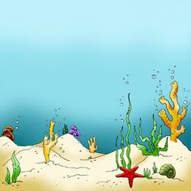
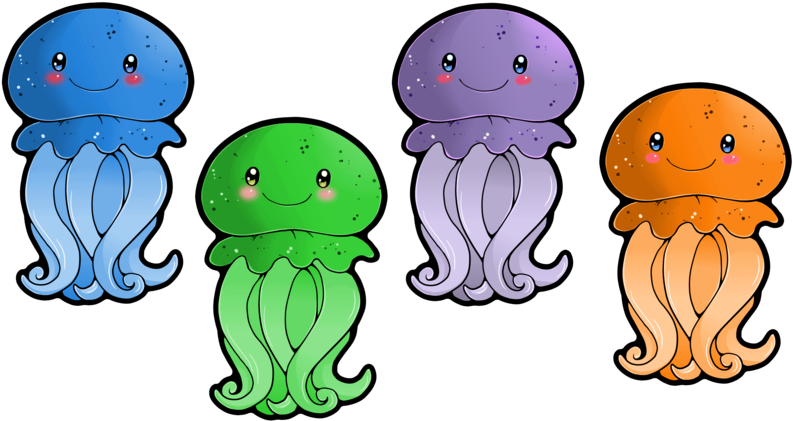

# Golden jellyfish
--------
Have you ever seen a golden jellyfish in your life? The truth is no one ever saw these creatures yet the legends tell they exist. It is argued that golden jellyfish only live at the top of the [sunken treasures](http://www.sunkentreasuresgames.com/). If it is so, you can be a lucky one to find gold in the ocean quickly. Just download the app and start collecting golden coins today!

## How does it work
-----
Once you download an app you find yourself in the magical underwater world. Your task is to find golden jellyfish tracing the hints. Be aware that other sea creatures can be both beneficial and harmful to you. The further you go, the more you will learn about this marine universe.

      

## Sea creatures
---
There are three types of sea inhabitants you will meet: **good**, **bad** and **magical**. Good characters are always willing to help and provide you with multiple hints where to find a golden jellyfish. Bad characters are sleezy and misleading. They may pretend to be good but they will lead you astray. Magical characters will tease you and be naughty. You never know what they are up to.

 Among the creatures that you are most likely to meet in the first three rounds are:
 
 

* Green jellyfish
* Pink jellyfish
* Sea stars
* Fluffy octopus
* Curious seahorse

:ocean:What to look for
---
Try to look for arrows and golden bubbles. These are sure signs of the golden jellyfish mingling around.
Aside these hints you might find next items useful:
1. Broken shells. Jellyfish like to sleep under these.
2. Human stuff like coins, plastic cups and beach inventory. It indicates other people were hunting for jellyfish here.
3. Purple algae. Golden jellyfish eat only this type of algae.
